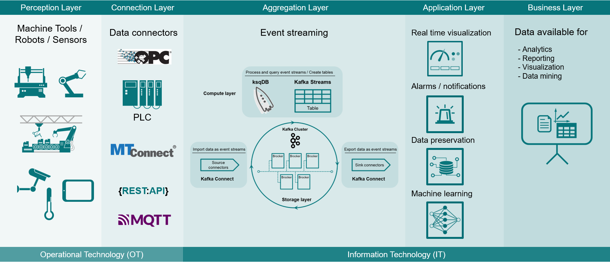
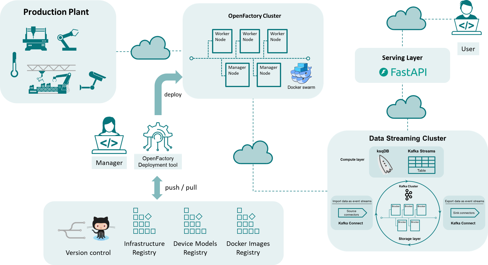

# OpenFactory

## What is OpenFactory?

> **OpenFactory** is a deployment and coordination platform for the physical world.
>
> It brings DevOps thinking to manufacturing — making the real world **versionable**, **testable**, **programmable**, and **connected at scale**.

It is designed for large-scale, low-latency coordination, with the goal of managing thousands of assets and handling millions of events per second through Kafka-powered data pipelines.

👉 [Read the full OpenFactory Manifesto](docs/MANIFESTO.md)

## Key Features

- **Device Integration**: Supports both [MTConnect](http://mtconnect.org)-enabled devices directly and non-enabled devices via adapters, providing flexibility in connecting diverse equipment.
- **Data Streaming to Kafka**: Although Kafka itself is not part of *OpenFactory*, the system includes everything needed to prepare, process, and stream device data into a Kafka instance.
- **Microservices Architecture**: Using Docker Swarm, *OpenFactory* orchestrates each microservice independently, allowing for modular, scalable deployments.
- **Infrastructure as Code (IaC)**: Fully configurable via YAML files, *OpenFactory* leverages IaC principles, making it easy to define, version, and deploy infrastructure consistently across environments.
- **Flexible Deployment Options**: Deploy *OpenFactory* on-premises, in the cloud, or in a hybrid configuration to meet operational needs.

## Overview

**OpenFactory** aims to streamline the integration of manufacturing devices into a cohesive data processing ecosystem, enabling efficient data streaming to Kafka for analysis and decision-making, and sending back commands to devices to execute actionable items.

It is a distributed cluster designed for seamless integration of manufacturing devices, providing an adaptable infrastructure to interface both MTConnect-enabled and retrofitted devices using adapters when necessary.

The architecture supporting *OpenFactory* is organized into five distinct layers:

1. **Perception Layer**: This foundational layer consists of devices such as sensors and manufacturing equipment that collect data from and send commands to the physical environment.

2. **Connection Layer**: This layer comprises data connectors that facilitate communication between devices and the system and supervisors sending back commands to devices willing to respond to them.

3. **Aggregation Layer**: Here, Kafka acts as a storage layer, while ksqlDB serves as a compute layer, enabling the processing and organization of incoming data streams.

4. **Application Layer**: Following data streaming with Kafka sink connectors, various applications can utilize the data for real-time visualization, alarm notifications, data preservation, and machine learning.

5. **Business Layer**: In this top layer, the data is prepared for advanced tasks such as analytics, reporting, visualization, and data mining, enabling organizations to derive actionable insights from their data.

## Documentation
:books: Documentation: https://openfactory-doc.readthedocs.io/en/latest/index.html

## Architecture

*OpenFactory* employs a microservices architecture orchestrated by Docker Swarm, where various microservices required for device integration are automatically created and deployed based on YAML configurations. Key components include:

* **Adapters**: Ensure data and command compatibility between devices and the platform.
* **Connectors**: Collect and transmit data from devices to **Kafka**, using Adapters if required.
* **Supervisors**: Send commands from **Kafka** to devices.
* **Applications**: Process data in real time, make decisions, and emit commands.
* **Kafka**: Serves as the data streaming platform where processed data is sent.
* **ksqlDB**: Provides real-time stream processing, enabling dynamic querying and transformation of data streams.
* **Docker Swarm**: Coordinates and manages microservices across the cluster for optimal performance.
* **Registry**: Serves as the central source of truth for device and application configurations, device models, application code, and Docker images, ensuring consistent deployments and operations.

## **How It Works**

1. **Device / Application Onboarding**

   * The device or application is described in a YAML configuration and stored in the **Registry**.
   * The Registry holds the configurations, device models, application code, and Docker images needed for deployment.
   * *OpenFactory* automatically deploys the necessary **Adapters**, **Connectors**, and **Supervisors** as Docker Swarm services on the OpenFactory cluster, pulling the required images from the Registry as needed.

2. **Data Ingestion**

   * **Connectors** collect device data.
   * If needed, an **Adapter** converts the data into a standard format.
   * Data is published to **Kafka**.

3. **Real-Time Processing**

   * **Applications** subscribe to Kafka topics and process data for analytics, decision-making, or triggers.
   * **ksqlDB** allows dynamic filtering, aggregation, and transformation without writing custom code.

4. **Command Execution**

   * **Applications** (or ksqlDB queries) produce command messages.
   * **Supervisors** receive these commands from Kafka and send them to devices via the proper Connector/Adapter path.

## **Platform Capabilities**

### **Scalability**

*OpenFactory* is built to grow with demand. Its microservices architecture, managed by Docker Swarm, allows each service to be scaled independently. As more devices are connected or data volumes increase, resources can be added seamlessly to support both horizontal and vertical scaling without disrupting operations.

### **Elasticity**

The platform automatically adapts to changing workloads. Services can scale up or down in real time based on data flow and processing needs, ensuring efficient resource usage and optimal performance without manual intervention.

### **Fault Tolerance**

High availability is built in. Docker Swarm replicates microservices across nodes so that even if some components fail, the system remains operational. This redundancy minimizes downtime and ensures continuous data collection, processing, and control.

### **Hybrid Deployment**

*OpenFactory* can run across both on-premises and cloud infrastructure, giving organizations the flexibility to balance performance, latency, and cost. Critical operations can be kept local while leveraging cloud resources for scalability and advanced analytics.

### **Distributed Architecture**

The platform’s services can be deployed across multiple nodes, enabling parallel data processing and improved reliability through redundancy. This distribution ensures that large volumes of device data are handled efficiently and without bottlenecks.

### **Alignment with RAMI 4.0**

*OpenFactory* aligns with the principles of the [RAMI 4.0 framework](https://www.sci40.com/english/thematic-fields/rami4-0/), providing a structured, standards-based approach to integrating devices within a digital manufacturing environment.

## License

This project is licensed under the [Polyform Noncommercial License 1.0.0](LICENSE), effective from release **v0.2.0**.

### **Non-Commercial Use**
Use, modification, and distribution of this software are permitted for **academic, research, and personal purposes**, provided that such use is **non-commercial** in nature.

### **Commercial Use**
Commercial use—including use in any paid product, service, or Software-as-a-Service (SaaS) offering—**requires a separate commercial license**. Interested parties must contact the project maintainer to obtain explicit written permission. Licensing discussions and agreements are managed in coordination with the Concorida Univerity technology transfer office.

For licensing inquiries, please contact: [rolf.wuthrich@concordia.ca]

### **Previous License (v0.1.1 and earlier)**
Versions up to and including **v0.1.1** were released under the **BSD-3-Clause License**. That license remains applicable solely to those earlier versions.

## Contributing

Contributions are welcome under the terms of the **Polyform Noncommercial License**. 

Please note:
- Contributions must align with the project's **non-commercial licensing model**.
- Organizations or individuals intending to use the project in **commercial contexts** must initiate a licensing discussion prior to contributing code.

For guidelines on contributing, refer to [CONTRIBUTING.md](CONTRIBUTING.md).
