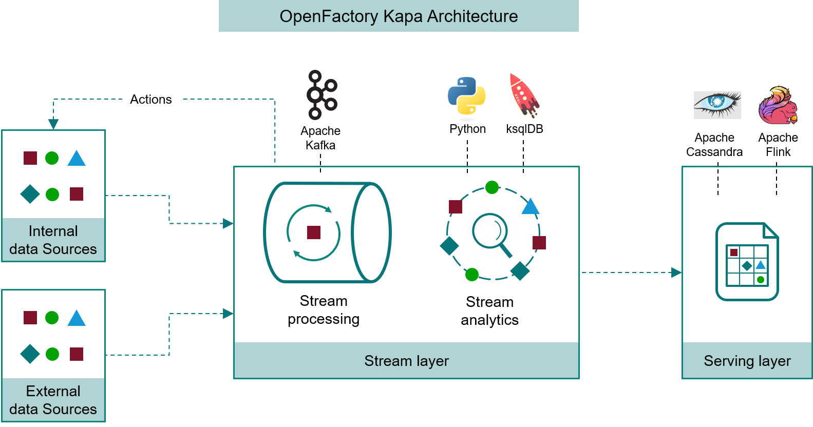
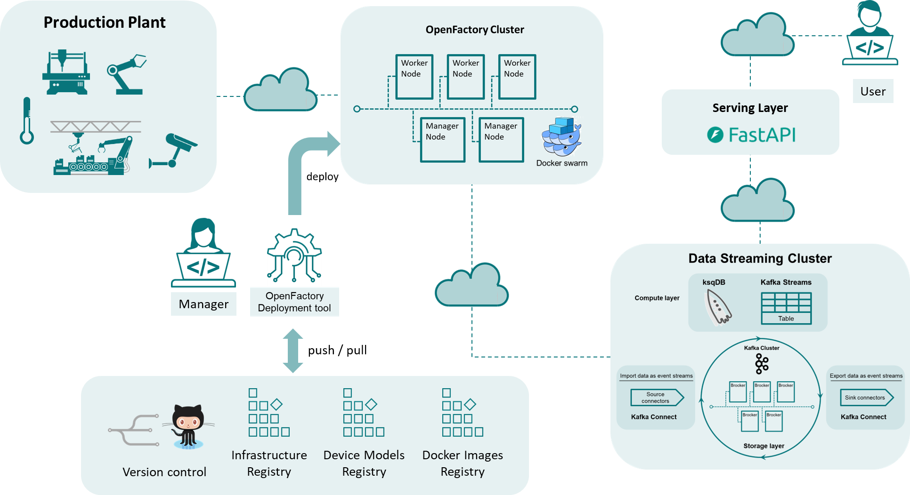

# OpenFactory Overview

**OpenFactory** is a modular, software framework designed to support the development and operation of data-centric, event-driven industrial systems. It provides a scalable, real-time infrastructure for monitoring, analyzing, and controlling industrial assets through a distributed, fault-tolerant streaming architecture. Grounded in the principles of **Industry 4.0**, OpenFactory enables the **virtualization of physical assets** and their orchestration via a **data stream-based control loop**.

## Architectural Foundations

OpenFactory is organized around a **Kappa architecture**, in which data flows unidirectionally from sources (industrial assets) into a persistent stream processing layer, and actions can be emitted downstream to influence those same assets. 

The system supports **hybrid deployment modes**, operating across on-premise edge systems and cloud environments, with elasticity, fault tolerance, and high throughput.

To fully implement this architecture, OpenFactory relies on the following core building blocks:

### 1. The Factory (Physical Layer)

At the lowest layer are the **physical assets**, such as machines, sensors, actuators, and industrial controllers. These assets are considered **data producers and consumers**, capable of both emitting real-time telemetry and receiving control commands.

Each asset is semantically modeled following closley exisitng standards (MTConnect, RAMI4.0) and virtualized into the system through specialized **connectors**, which translate between industrial protocols (e.g., OPC UA, Modbus, MTConnect) and the OpenFactory data model.

---

### 2. The OpenFactory Cluster (Service and Orchestration Layer)

This layer hosts the **microservices** that interface with physical assets, perform stream processing, and serve user applications. The cluster is managed using **Docker Swarm**, enabling resilient and distributed deployments across heterogeneous compute environments.

Microservices deployed in the OpenFactory cluster include:

* **Connectors** to ingest data from assets and send actions back
* **Stream processors** (Python or ksqlDB-based)
* **Serving applications** such as dashboards, APIs, or alerts

The cluster acts as a programmable runtime where service composition, deployment, and scaling are fully automated and driven by version-controlled configuration files.

---

### 3. The Kafka Cluster (Streaming Backbone)

The **Kafka cluster** is the central data plane of OpenFactory. It provides:

* **Persistent and ordered streams** of events from industrial assets
* **Topic-based routing** of data across the system
* **High throughput and low latency**, supporting real-time processing at scale

Stream processing is performed through:

* **ksqlDB**: a SQL-like engine for declarative stream analytics (e.g., filtering, aggregation, enrichment)
* **Custom Python services** for advanced logic (e.g., anomaly detection, machine learning inference)

All asset interactions—both data ingestion and control signals—pass through Kafka topics, enabling complete observability and replayability of asset behavior.

---

### 4. The Repositories (Infrastructure and Knowledge Layer)

OpenFactory emphasizes **Infrastructure as Code (IaC)** and **Versioned Asset Models**. This layer includes:

* **Configuration repositories**, defining service deployment, Kafka topics, and ksqlDB queries
* **Asset model repositories**, encoding metadata, identifiers, and behavioral models of each physical asset
* **Docker image registries**, storing containerized versions of OpenFactory services and connectors

By externalizing all definitions into version-controlled repositories (e.g., Git), OpenFactory enables consistent deployments, rollback capabilities, CI/CD pipelines, and collaborative development across teams.

---

### 5. External Users and Applications (Serving Layer)

External stakeholders—such as operators, engineers, analysts, or third-party applications—interact with OpenFactory through the **serving layer** of the Kappa architecture. This includes:

* **User-facing services** (e.g., dashboards, REST APIs)
* **Streaming APIs** (e.g., WebSocket or Server-Sent Events endpoints)
* **Data export tools** (e.g., time-series databases, external BI systems)

The serving layer provides access to both **raw and processed data**, enabling integration with enterprise systems (e.g., ERP, MES), and supports the development of **data-driven decision-making** tools such as predictive maintenance systems or adaptive process controllers.
