# ksqlDB Topologies

This folder contains the ksqlDB scripts used to create the initial streams and tables required by **OpenFactory**.

## Topology overview

```mermaid
flowchart TD

    %% ---------------------------------------------------------------------
    %% Source Streams / Tables (Kafka-backed)

    subgraph Sources["**Kafka Source Topics**"]
        assets_stream["**assets_stream**
        STREAM
        topic: *ofa_assets*"]

        asset_to_uns_map_raw["**asset_to_uns_map_raw**
        TABLE
        topic: *asset_to_uns_map_topic*"]

        cmds_stream["**cmds_stream**
        STREAM
        topic: *ofa_cmds*"]

        device_connector_source["**DEVICE_CONNECTOR_SOURCE**
        TABLE
        topic: *device_connector_topic*"]
    end

    %% ---------------------------------------------------------------------
    %% Assets Core Topology

    subgraph Assets["**Assets Processing**"]
        enriched_assets_stream["**enriched_assets_stream**
        STREAM
        topic: *enriched_assets_stream_topic*"]

        assets_table["**assets**
        TABLE"]

        assets_aggregated_by_asset_uuid["**assets_aggregated_by_asset_uuid**
        TABLE"]
    end

    %% ---------------------------------------------------------------------
    %% Derived Asset Views

    subgraph AssetViews["**Derived Asset Views**"]
        docker_services_stream["**docker_services_stream**
        STREAM
        topic: *docker_services_topic*"]

        docker_services_table["**docker_services**
        TABLE"]

        assets_type_stream["**assets_type_stream**
        STREAM
        topic: *assets_types_topic*"]

        assets_type_tombstones["**assets_type_tombstones**
        STREAM
        topic: *assets_types_topic*"]

        assets_type_table["**assets_type**
        TABLE"]

        assets_avail_stream["**assets_avail_stream**
        STREAM
        topic: *assets_avail_topic*"]

        assets_avail_tombstones["**assets_avail_tombstones**
        STREAM
        topic: *assets_avail_topic*"]

        assets_avail_table["**assets_avail**
        TABLE"]
    end

    %% ---------------------------------------------------------------------
    %% UNS Mapping

    subgraph UNS["**UNS Mapping**"]
        asset_to_uns_map_table["**asset_to_uns_map**
        TABLE
        *(identity materialization)*"]

        assets_stream_uns["**assets_stream_uns**
        STREAM
        topic: *ofa_assets_uns*"]

        assets_uns_table["**assets_uns**
        TABLE"]
    end

    %% ---------------------------------------------------------------------
    %% Device Integration

    subgraph Devices["**Device Integration**"]
        device_connector_table["**DEVICE_CONNECTOR**
        TABLE
        *(identity materialization)*"]
    end

    %% ---------------------------------------------------------------------
    %% External Consumers

    external_consumers["External Consumers / Applications"]

    %% ---------------------------------------------------------------------
    %% Main flows

    %% Assets main flow
    assets_stream --> enriched_assets_stream
    enriched_assets_stream --> assets_table
    assets_table --> assets_aggregated_by_asset_uuid

    %% Docker services
    assets_stream --> docker_services_stream
    docker_services_stream --> docker_services_table

    %% Asset types
    assets_stream --> assets_type_stream
    assets_stream --> assets_type_tombstones
    assets_type_stream --> assets_type_table
    assets_type_tombstones --> assets_type_table

    %% Asset availability
    assets_stream --> assets_avail_stream
    assets_stream --> assets_avail_tombstones
    assets_avail_stream --> assets_avail_table
    assets_avail_tombstones --> assets_avail_table

    %% UNS mapping (identity + join)
    asset_to_uns_map_raw -.->|*identity projection*| asset_to_uns_map_table
    assets_table --> assets_stream_uns
    asset_to_uns_map_table --> assets_stream_uns
    assets_table --> assets_uns_table
    asset_to_uns_map_table --> assets_uns_table

    %% Commands
    cmds_stream --> external_consumers

    %% Device connector (identity projection)
    device_connector_source -.->|*identity projection*| device_connector_table

    %% ---------------------------------------------------------------------
    %% Styling

    classDef stream fill:#e3f2fd,stroke:#1e88e5,stroke-width:1px
    classDef table fill:#e8f5e9,stroke:#2e7d32,stroke-width:1px
    classDef external fill:#fff3e0,stroke:#fb8c00,stroke-width:1px

    class assets_stream,enriched_assets_stream,assets_stream_uns,docker_services_stream,assets_type_stream,assets_type_tombstones,assets_avail_stream,assets_avail_tombstones,cmds_stream stream
    class assets_table,assets_aggregated_by_asset_uuid,docker_services_table,assets_type_table,assets_avail_table,asset_to_uns_map_raw,asset_to_uns_map_table,assets_uns_table,device_connector_source,device_connector_table table
    class external_consumers external
```

## OpenFactory Assets by `ASSET_UUID`

The script [001-assets.sql](001-assets.sql) defines the topologies related to OpenFactory assets based on the source data (keyed by `ASSET_UUID`).

The script is documented [here](assets.md).

## OpenFactory Assets by Unified Namespace (`UNS_ID`)

The script [002-assets-uns.sql](002-assets-uns.sql) defines the topologies for OpenFactory assets using Unified Namespace classification (keyed by `UNS_ID`).

The script is documented [here](assets_uns.md).
